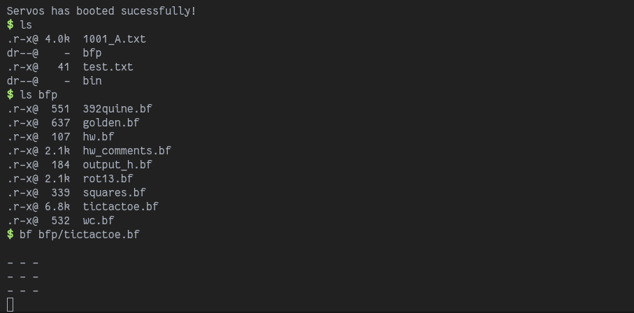

# Servos

Servos is a toy RISC-V kernel built in a month to learn about OS development.



## Build

To build servos you will need the `riscv64imac-unknown-none-elf` target installed. You can get it with:
```sh
rustup target add riscv64imac-unknown-none-elf
```

You will also need `qemu-system-riscv64` installed.

Next, build the user programs, copy them to the `initrd` folder, and generate the virtual disk.

```sh
cargo b --bin init
rsync target/riscv64imac-unknown-none-elf/debug/init initrd/bin/init

# (do this for each user program you want)

python mkfs.py initrd initrd.img
```

If you have `just` installed, you can run `just initrd` to do this automatically. Then, you can start the kernel in QEMU with:
```sh
cargo r --bin servos
```

To close QEMU, press Ctrl+A, x.
